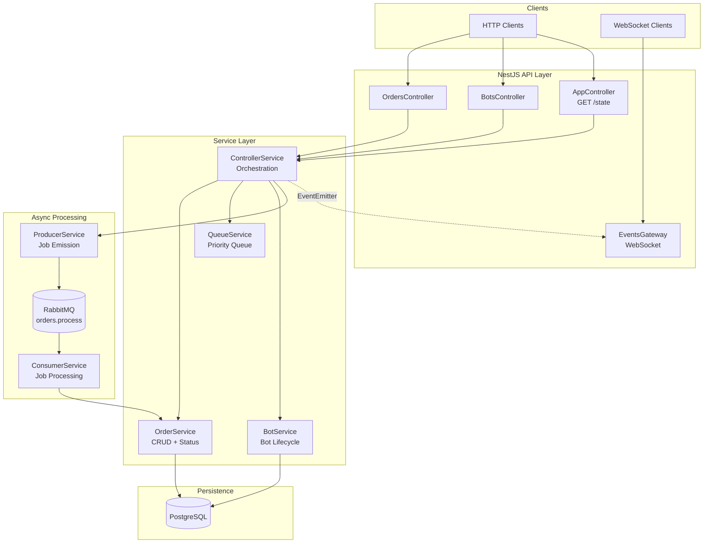
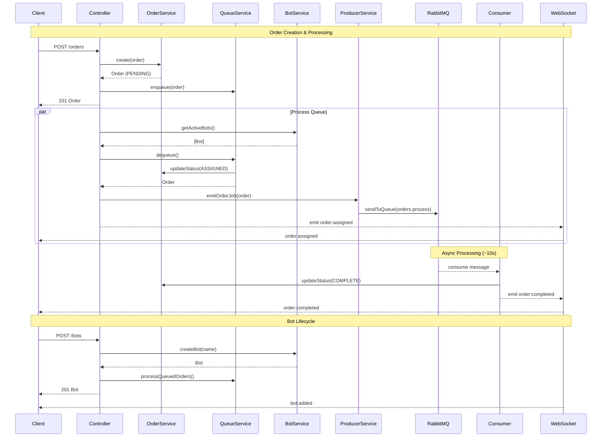

# NestJS Queue Management System

A NestJS-based queue management system with priority ordering, RabbitMQ async processing, and real-time WebSocket updates — migrated from a Go implementation.

## Architecture



## Process Flow



## Tech Stack

| Component | Technology | Purpose |
|---|---|---|
| **Framework** | NestJS 11 + TypeScript | Application framework |
| **Database** | PostgreSQL + TypeORM | Persistent storage (Order, Bot entities) |
| **Message Queue** | RabbitMQ (amqp-connection-manager) | Async bot job processing |
| **Real-Time** | Socket.IO (NestJS WebSocket Gateway) | Live state push to clients |
| **Rate Limiting** | @nestjs/throttler | 100 req/min per IP on POST /orders |
| **Testing** | Jest + Supertest | Unit, integration, and load tests |

## Project Structure

```
src/
├── app.module.ts              # Root module
├── app.controller.ts          # GET /, GET /state
├── entities/                  # TypeORM entities
│   ├── order.entity.ts        # Order (id, type, status, payload, priority)
│   └── bot.entity.ts          # Bot (id, name, active)
├── modules/
│   ├── order/
│   │   ├── order.module.ts
│   │   ├── order.service.ts   # CRUD + status transitions
│   │   ├── order.controller.ts# POST /orders, GET /orders, GET /orders/:id
│   │   └── dto/
│   ├── queue/
│   │   ├── queue.module.ts
│   │   ├── queue.service.ts   # In-memory priority queue (VIP + Normal FIFO)
│   │   ├── producer.service.ts# RabbitMQ job emission
│   │   ├── consumer.service.ts# Job processing (10s simulated work)
│   │   └── rabbitmq.service.ts# Connection lifecycle
│   ├── bot/
│   │   ├── bot.module.ts
│   │   ├── bot.service.ts     # Bot CRUD + active tracking
│   │   └── bot.controller.ts  # POST /bots, GET /bots, DELETE /bots/:id
│   ├── controller/
│   │   ├── controller.module.ts
│   │   └── controller.service.ts# Orchestration layer
│   └── gateway/
│       ├── gateway.module.ts
│       └── events.gateway.ts  # WebSocket event broadcasting
└── common/
    └── filters/
        └── global-exception.filter.ts
test/
├── phase5.e2e-spec.ts         # Integration tests
└── load/
    └── priority.load-spec.ts  # Load tests (500 concurrent orders)
```

## Priority Queue Logic

Orders are queued by priority tier — VIP orders are always dequeued before Normal orders. Within each tier, FIFO order is preserved.

| Operation | VIP Placement | Normal Placement |
|---|---|---|
| `enqueue()` | After last existing VIP | Append to tail |
| `enqueueFront()` | Before first Normal (after existing VIPs) | Absolute head |

## API Endpoints

| Method | Path | Description | Rate Limited |
|---|---|---|---|
| `GET` | `/` | Health check | No |
| `GET` | `/state` | Full system state (orders, queue, bots) | No |
| `POST` | `/orders` | Create order `{ orderType: "VIP"\|"NORMAL", payload?: string }` | Yes (100/min/IP) |
| `GET` | `/orders` | List all orders | No |
| `GET` | `/orders/:id` | Get order by ID | No |
| `POST` | `/bots` | Add bot `{ name: string }` | No |
| `GET` | `/bots` | List all bots | No |
| `DELETE` | `/bots/:id` | Remove bot (soft-delete) | No |

## WebSocket Events

Connect to `ws://localhost:3000`:

| Event | Direction | Payload |
|---|---|---|
| `order:created` | → client | `{ id, orderType, status, ... }` |
| `order:assigned` | → client | `{ id, botId, ... }` |
| `order:completed` | → client | `{ id, status: "COMPLETE", ... }` |
| `bot:added` | → client | `{ id, name, active: true }` |
| `bot:removed` | → client | `{ id }` |
| `state:updated` | → client | `{ orders: [], queue: [], bots: [] }` |

## Setup

### Prerequisites

- Node.js 22+
- PostgreSQL
- RabbitMQ

### Environment

```bash
cp .env.example .env
# Edit .env with your DB and RabbitMQ credentials
```

Key defaults:

| Variable | Default |
|---|---|
| `DB_HOST` | `localhost` |
| `DB_PORT` | `5432` |
| `DB_USER` | `postgres` |
| `DB_PASSWORD` | `postgres` |
| `DB_NAME` | `nest_rabbitmq` |
| `RABBITMQ_URL` | `amqp://localhost` |

### Install & Run

```bash
npm install
npm run start:dev        # Development (watch mode)
```

### Database

```bash
# Run migrations
npm run typeorm:migrate

# Revert last migration
npm run typeorm:revert
```

The app does **not** use `synchronize: true` — always run migrations explicitly in production.

## Testing

```bash
# Unit tests (39 tests across 11 suites)
npm test

# E2E + Load tests (10 tests across 3 suites)
npm run test:e2e

# All tests (49 total)
npm test && npm run test:e2e
```

### What's tested

| Suite | Tests | Scope |
|---|---|---|
| **Unit** | 39 | Order, Bot, Queue, Producer, Consumer, RabbitMQ services + Controllers + WebSocket Gateway |
| **Integration** (e2e) | 4 | HTTP pipeline through full AppModule (order → state → bot lifecycle → 404) |
| **Load** | 5 | 500 concurrent orders, VIP priority enforcement, FIFO within tiers, enqueueFront behavior |
| **Manual** | — | `TEST_CHECKLIST.md` with 10-section interactive checklist |
